[README_EN](./doc/README_EN.md)

# 使用说明

效果：


## 1 前置准备

1. 运行脚本文件：`markdown2potplayer`
2. 双击右下角的托盘图标

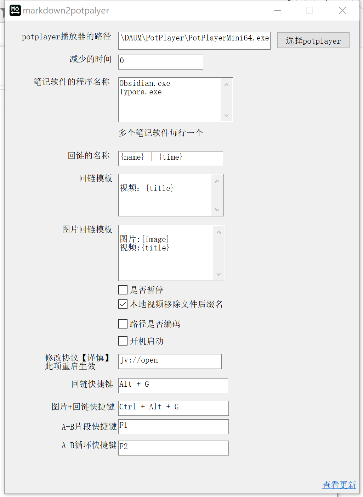

**修改1**：修改Potplayer的主程序路径，为你本机的路径

**修改2**：指定笔记软件的软件名称

- `说明`：只会按照从上至下的顺序，给1个笔记软件粘贴回链
- 例如：此处同时配置了obsidian和typora
  - 情况1：在obsidian和typora同时打开的情况下，只会粘贴到obsidian中
  - 情况2：只有typora打开，则粘贴到typora中


## 2 使用

1. 打开`markdown2potplayer`
1. 打开obsidian
1. 打开potplayer

3. 在笔记软件、或者potplayer`窗口激活`的状态下，<b style="color:red">按热键Alt+G(默认)</b>，即可自动粘贴**视频的回链**到obsidian中
4. 在笔记软件、或者potplayer`窗口激活`的状态下，<b style="color:red">按热键Ctrl+Alt+G(默认)</b>，即可自动粘贴**图片+视频的回链**到obsidian中

# 高级设置

## 关于notion

1. notion是运行在浏览器中，目前浏览器众多
2. 暂时支持如下
   1. 微软Edge：msedge.exe
   2. 谷歌：chrome.exe
   3. 360极速版：360chrome.exe
   4. 火狐：firefox.exe

3. **请 鼠标左键 点击notion中的链接，不要使用新建标签页打开 例如：Ctrl + 鼠标左键、鼠标中键**


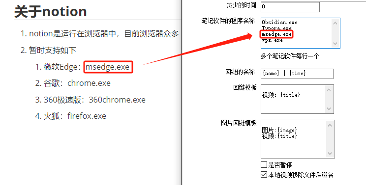


## 模板的修改

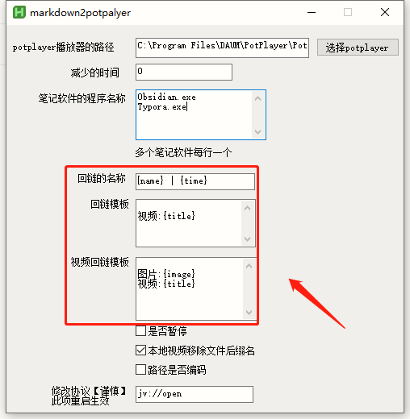

此处修改的是**粘贴数据的模板**，一共有`6`个模板项。


**注意**：这5项，不是哪个位置都可以用

- 字幕模板：只能用`{subtitle}`
- 回链的名称：只能用`{name}`、`{time}`、`{subtitleTemplate}`
- 回链模板：只能用`{title}`、`{subtitleTemplate}`
- 视频回链模板：只能用`{image}`、`{title}`、`{subtitleTemplate}`


逐一说明：

- `{name}`：代表视频的文件名称，也就是`[`视频**名称**`]`
- `{time}`：代表当前播放视频的时间，也就是`[`视频**时间**`]`
- `{title}`：**代表整个markdown格式的链接**，例如`[百度](https://www.baidu.com)`也就是说，此处是markdown格式的potplayer回链
- `{image}`：代表**图片粘贴的位置**
- `{subtitle}`: 代表的是当前在potplayer播放的视频中，能够复制的字幕
- `{subtitleTemplate}`: 代表的是 字幕模板 ，**如果当前播放的视频中没有字幕时，字幕模板将不会有数据产生**，也就是说没有字幕，则`{subtitleTemplate}`消失


### 示例1

我想要`Alt+G`是这个效果

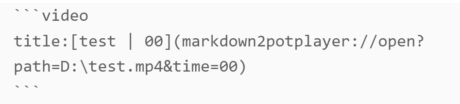

此处应该这么填

1. 先确定**回链中的`[]`内的名称**

```
{name} | {time}
```

2. 再确定**整个模板的数据**

````
```Video
title: {title}
```
````

最终效果

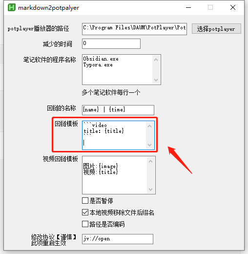

### 示例2

我想要`Ctrl+Alt+G`是这个效果

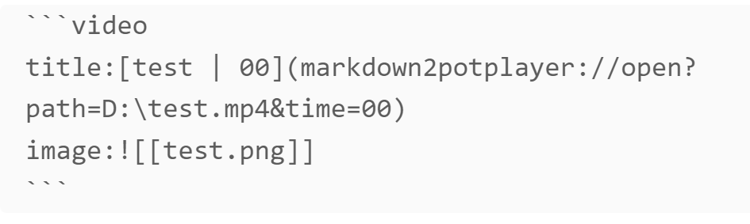

视频回链模板此处应该这么填

````ini
```video
title:{title}
image:{image}
```
````


### 示例3

**思源笔记的换行**请使用html的`<br/>`标签，参考：[#16](https://github.com/livelycode36/markdown2potplayer/issues/16)

```html
{title}<br/>
{image}

```

### 示例4
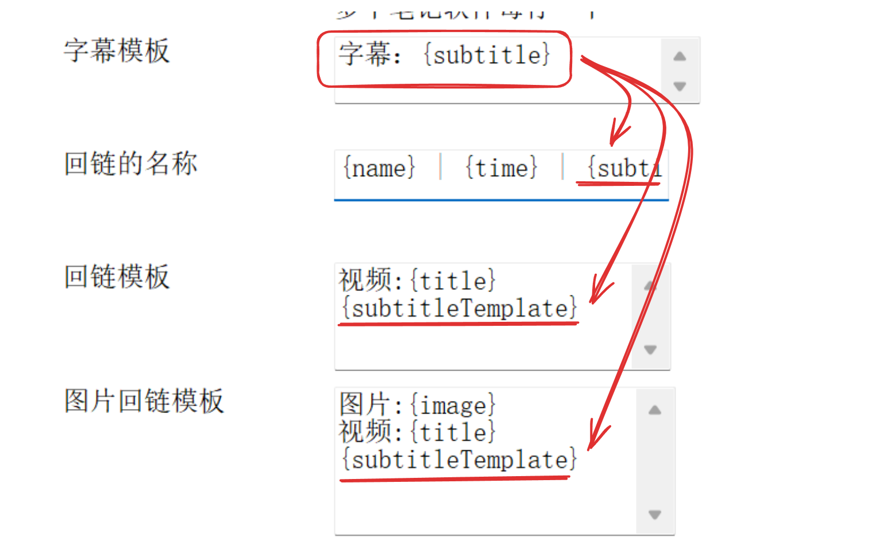


## 播放B站视频

1. Potplayer需要提前安装插件：[chen310/BilibiliPotPlayer](https://github.com/chen310/BilibiliPotPlayer)

2. 按照插件的使用文档，在potplayer中播放视频
3. 使用快捷键打时间戳即可


## 调整时间的格式

这里

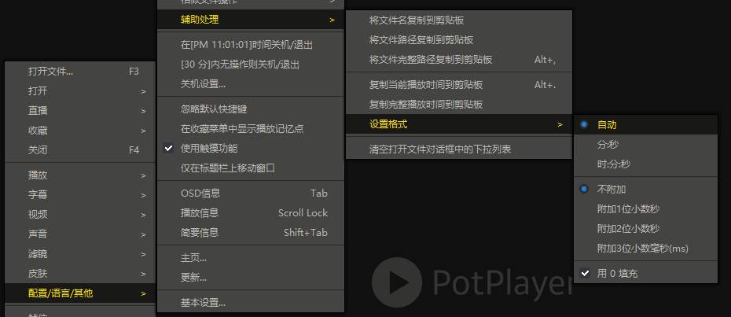


## AB片段

**使用**：

1. 首次，按快捷键记录起点

2. 再次，按快捷键记录终点，并生成回链，插入到笔记软件中


**注意**：

1. 当起点**大于**终点时，例如：起点05:00，终点01:00，则`互换起点终点`，起点01:00，终点05:00
2. 当按下起点的快捷键，**想取消**，按`Esc`即可


### AB片段

播放**单次**，在起点播放，在终点暂停

播放之后，不想在终点暂停，按`Esc`即可取消终点暂停


### AB循环

使用Potplayer自带的"AB区段循环"实现，默认**无限播放**

**关闭AB区段循环**：Potplayer**默认快捷键`/`**


## 视频文件的后缀名

控制名称中是否包含文件名的后缀

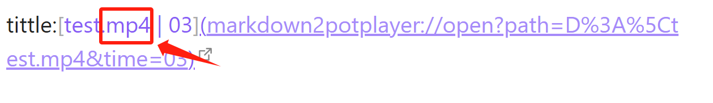


## 地址是否编码

控制视频地址，是否使用编码

**关闭编码的效果**

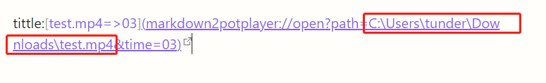

注意

- 目前发现的bug：
  1. 全系urlencode的bug：如果路径中存在`\[`、`\!`会让，在【ob的预览模式】下(回链会被ob自动urlencode)，`\[`中的`\`消失变为,`[`；例如：`G:\BaiduSyncdisk\123\[456]789.mp4` 在bug下变为：`G:\BaiduSyncdisk\123[456]789.mp4` <= `\[`丢失了`\`，所以即使关闭编码也会强制在`\[`出现在路径中，将`\[`中的`\`进行编码。如果不想被编码，请不要这样给视频文件命名 或 使用`-`、`_`等替代
  2. 关闭编码之后，假如视频的路径中有`空格`，在obsidian的预览模式，回链`不会渲染为链接`，所以即使关闭编码也会强制将空格进行编码。如果不想空格也被编码，可以去掉文件中的空格 或 使用`-`、`_`等替代空格
- 可能还有其他符号也有类似的问题，但暂未发现


## Potplayer快捷控制


方便在笔记软件中控制potplayer


**前进、后退精确到`秒`**

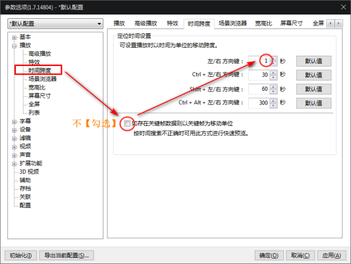

**精确到0.5秒等**

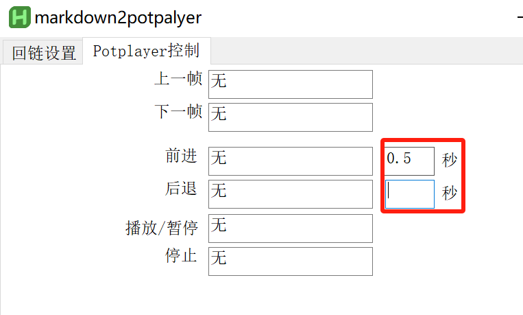

- 因为potplayer自带最少是1秒，所以此处可以设置0.x秒
- 注意：
  - 填写`0`，则调用potplayer中用户设置的时间跨度时间。**不可以留空**


## 自定义跳转协议

适合自定义协议的人使用【谨慎】

修改的是此处


## 多国语言

1. 在这里有语言的代号：[LCID.ahk](./lib/gui/i18n/LCID.ahk)
2. 这是示例
   1. [en-US.ini](./lib/gui/i18n/en-US.ini)
   2. [zh-CN.ini](./lib/gui/i18n/zh-CN.ini)

- **注意：ini文件请使用使用系统的默认 ANSI 编码！**
  - 参考：[IniRead| AutoHotkey v2](https://www.autohotkey.com/docs/v2/lib/IniRead.htm)


# 开发

1. 克隆仓库
2. 下载安装：[AutoHotkey](https://www.autohotkey.com/)的v2版本
3. 打开AutoHotkey Dash，点击`Compile`按照提示安装`Ahk2Exe`
4. 使用`Ahk2Exe`编译，如下文件
   1. 主程序：`markdown2potplayer.ahk`
   2. 控制potplayer：`\lib\note2potplayer\note2potplayer.ahk`
   3. word文档链接的形式：`\lib\word\word.ahk`


# 鸣谢

感谢

- [金](https://github.com/fireflysss)
- [YIRU69](https://github.com/YIRU69)
- 蚕子

给予的帮助与建议！