# 使用说明

## 0 目录介绍

```
obsidian2potplayer
├─ config.ini【配置文件】
├─ note2potplayer.ahk
├─ note2potplayer.exe
├─ potplayer2note.ahk【脚本】
├─ README.md
├─ 安装包
│  ├─ AutoHotkey_2.0.10_setup.exe
│  └─ Notepad--v2.11.0-win10-portable.zip
├─ lib
│  ├─ MyTool.ahk
│  └─ ReduceTime.ahk
├─ assets
```


## 1 前置准备

下载zip源码

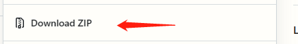


### 1.1 安装AutoHotKey

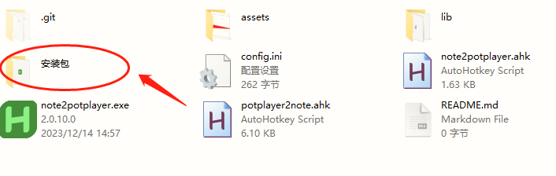

一路下一步，然后删掉

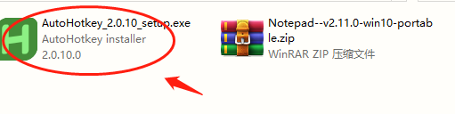

### 1.2 设置Potplayer的快捷键

1. 打开potplayer
2. 鼠标右键 “选项”，打开这个界面


**添加-快捷键1**


**添加-快捷键2**


最终效果


### 1.3 修改配置文件

1. 双击打开

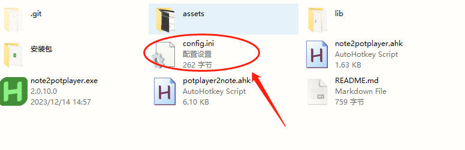

<b style="color:red">注意</b>

1. 如果，之前已经运行了脚本`potplayer2note.ahk`，在修改完毕之后，请重新运行脚本，让修改生效
2. ini的配置文件，对中文的兼容不太好，暂时先不要用中文、中文符号


**修改1**

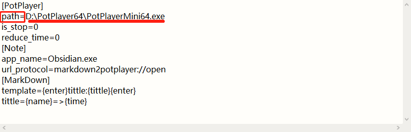

修改Potplayer的主程序路径，为你本机的路径

- **不要修改方框内的数据，仅修改下划线中的数据（接下来不在重复说明此处）**

按键盘的` Ctrl + S`，保存修改


**修改2**

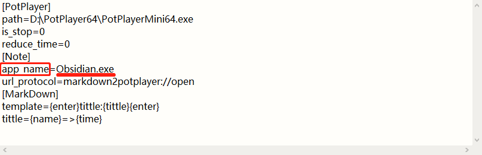

指定笔记软件的 软件名称，如使用的是Obsidian，则不需要修改

按键盘的` Ctrl + S`，保存修改


**修改3**


此处是**粘贴模板**的修改，一共有`5`项。


注意：

这5项，在配置文件中，不是哪个位置都可以用

- `tittle`这一项，只能用`{name}`、`{time}`

- `template`这一项，只能用`{enter}`、`{tittle}`
- `image_template`这一项，只能用`{image}`、`{enter}`、`{tittle}`


逐一说明：

- `{enter}`代表回车键
- `{name}`回链展示的名称，也就是[内的数据]：代表视频的文件名称
- `{time}`回链展示的名称，也就是[内的数据]：代表当前播放视频的时间
- `{title}`**代表整个markdown格式的链接**，例如`[百度](https://www.baidu.com)`也就是说，此处是markdown格式的potplayer回链
- `{image}`代表**图片粘贴的位置**


示例：

我想要`Alt+G`是这个效果


此处应该这么填

1. 先确定**回链中的[]内的名称**

```ini
tittle={name}=>{time}
```

2. 再确定**整个模板template的数据**

```ini
template=```Video{enter}title: {tittle}{enter}```{enter}
```

最终效果

```ini
[PotPlayer]
path=D:\PotPlayer64\PotPlayerMini64.exe
is_stop=0
reduce_time=0

[Note]
app_name=Obsidian.exe
url_protocol=markdown2potplayer://open

[MarkDown]
path_is_encode=1
tittle={name}=>{time}
template=```Video{enter}title: {tittle}{enter}```{enter}
image_template={enter}image:{image}{enter}tittle:{tittle}{enter}
```

按键盘的`Ctrl + S`，保存修改


## 2 使用

1. 修改配置文件：看上面👆
2. 双击运行脚本，没有界面，右下角有工作图标

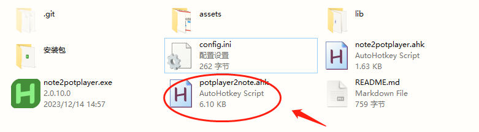

3. 打开obsidian
4. 打开potplayer
5. 在obsidian、或者potplayer`窗口激活`的状态下，<b style="color:red">按热键Alt+G(默认)</b>，即可自动粘贴**视频的回链**到obsidian中
6. 在obsidian、或者potplayer窗口激活的状态下，<b style="color:red">按热键Ctrl+Alt+G(默认)</b>，即可自动粘贴**图片+视频的回链**到obsidian中

# 高级设置

## 调整时间的格式

这里


## 暂停播放

粘贴之后暂停播放

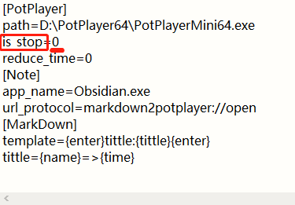

`is_stop`的值是0则关闭，非0则开启，所以你可以修改为1

按键盘的 `Ctrl + S`，保存修改

重启脚本

## 减少时间

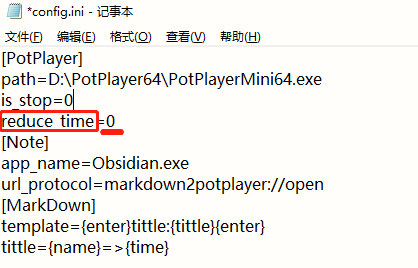

`reduce_time`的值是0则关闭，非0则开启，单位`秒`。

示例：我希望时间戳，每次粘贴都减少3秒，修改为`reduce_time=3`

按键盘的 `Ctrl + S`，保存修改

重启脚本


## 开机启动

参考：https://blog.csdn.net/liuyukuan/article/details/121526961

1. 按 Win + E ，打开 资源管理器

2. 在顶部的地址栏中，输入如下地址，回车进入这个文件夹

`C:%homepath%\AppData\Roaming\Microsoft\Windows\Start Menu\Programs\Startup`也就是这个路径`C:\Users\你电脑的用户名\AppData\Roaming\Microsoft\Windows\Start Menu\Programs\Startup`

3. 将脚本`potplayer2note.ahk`，在这个文件夹中，`创建快捷方式`

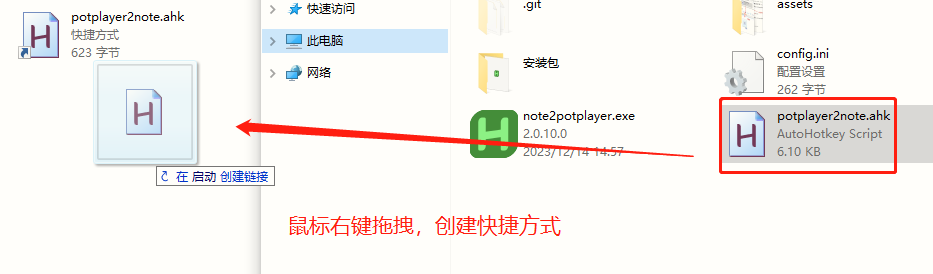

【去掉开机自启】：把脚本的快捷方式删了就ok

## 地址是否编码


path_is_encode=`0`的值是0，关闭编码

path_is_encode=`1`，非0则开启编码

提示：开启编码兼容性好一点


**关闭编码**


注意

- 目前发现的bug：关闭编码之后，假如视频的路径中有`空格`，在obsidian的预览模式，回链`不会渲染为链接`，所以即使关闭编码也会将空格进行编码
- 可能还有其他符号也有类似的问题，但暂未发现


## 自定义快捷键

修改源码，首先参考官方文档，如何自定义快捷键[热键 - 定义 & 使用 | AutoHotkey v2](https://wyagd001.github.io/v2/docs/Hotkeys.htm)

1. 使用文本编辑器，修改源码。因为使用的编码是UTF-8，windows默认的记事本，会有些许兼容问题，推荐使用文本编辑器

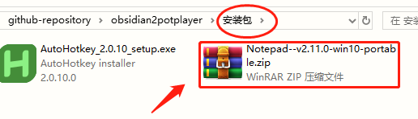


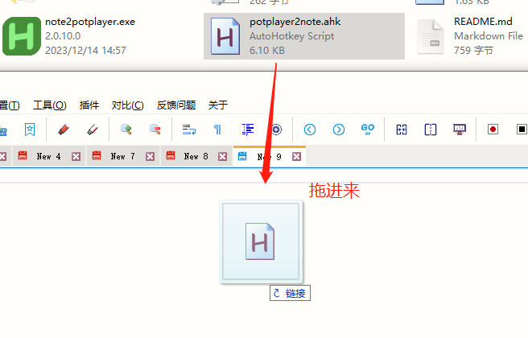

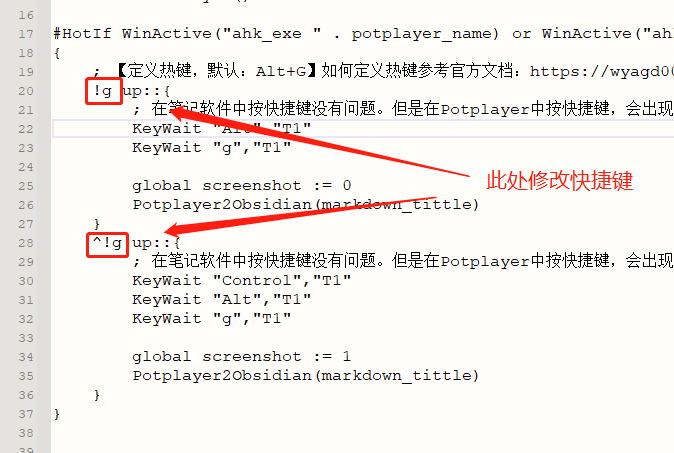


## 自定义跳转协议

适合自定义协议的人使用【谨慎】

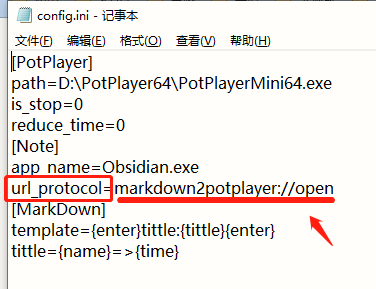

修改的是此处

