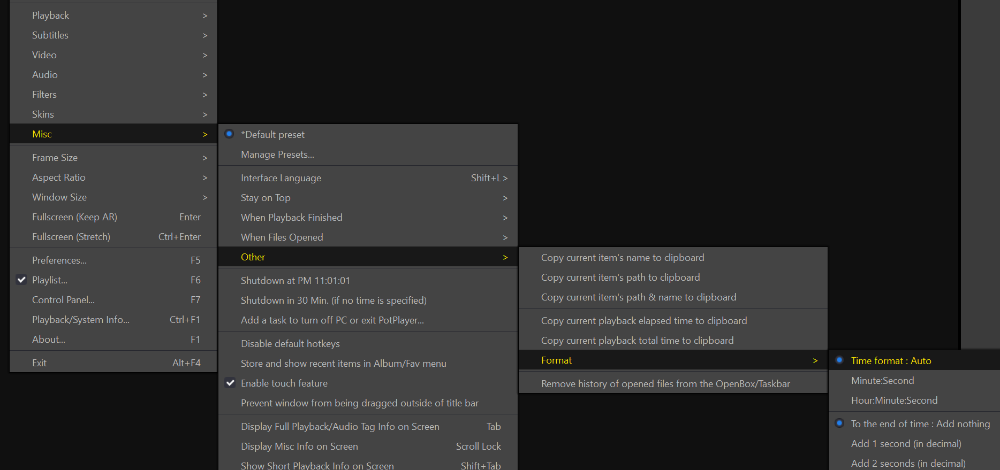

# Usage Instructions

## 1. Preparation

1. Run the script file: `markdown2potplayer`
2. Double-click the tray icon in the bottom right corner 


**Modification 1**: Update the path to Potplayer's main program(potplayer 播放器的路径) to match your local path.

**Modification 2**: Specify the name of your note-taking software(笔记软件的程序名称).

- `Note`: The backlink will only be pasted into one note-taking software, following the order from top to bottom.
- For example, if both Obsidian and Typora are configured:
  - Case 1: If both Obsidian and Typora are open, the backlink will only be pasted into Obsidian.
  - Case 2: If only Typora is open, the backlink will be pasted into Typora.

## 2. Usage

1. Open `markdown2potplayer`.
2. Open Obsidian.
3. Open Potplayer.

4. When the note-taking software or Potplayer window is active, press the hotkey <b style="color:red">Alt+G (default)</b> to automatically paste the **video backlink** (视频回链) into Obsidian.
5. When the note-taking software or Potplayer window is active, press the hotkey <b style="color:red">Ctrl+Alt+G (default)</b> to automatically paste the **image + video backlink** into Obsidian.

# Advanced Settings

## About Notion

1. Notion runs in a browser, and there are many browsers available.
2. Currently supported browsers include:
   - Microsoft Edge: `msedge.exe`
   - Google Chrome: `chrome.exe`
   - 360 Speed Browser: `360chrome.exe`
   - Firefox: `firefox.exe`

3. **Please click on the link in Notion with the left mouse button, do not use the open in a new tab option, such as Ctrl + left mouse button or middle mouse button.**


## Modifying Templates


There are `5` template items for **pasting templates**.

**Note**: Not all positions can use these four items.

- Subtitle Template: Only `{subtitle}` can be used.
- Backlink Name: Only `{name}` and `{time}` can be used.
- Backlink Template: Only `{title}` can be used.
- Video Backlink Template: Only `{image}` and `{title}` can be used.

Explanation:

- `{name}`: Represents the video file name, i.e., `[Video **Name**]`.
- `{time}`: Represents the current playback time of the video, i.e., `[Video **Time**]`.
- `{title}`: **Represents the entire Markdown format link**, e.g., `[google](https://www.google.com)`. This means that this is the Markdown format backlink for Potplayer.
- `{image}`: Represents the **position for pasting the image**.
- `{subtitle}`: represents the subtitles that can be copied from the video currently being played in PotPlayer.

  `{subtitleTemplate}`: represents the subtitle template. **If there are no subtitles in the currently playing video, no data will be generated for the subtitle template**, meaning if there are no subtitles, `{subtitleTemplate}` will disappear.

### Example 1

I want the effect of `Alt+G` to be this:


This should be filled in as follows:

1. First, determine the **name inside the `[]` of the backlink**:

```
{name} | {time}
```

2. Then, determine the **data for the entire template**:

````
```Video
title: {title}
```
````

Final effect:


### Example 2

I want the effect of `Ctrl+Alt+G` to be this:


The video backlink template should be filled in as follows:

````ini
```video
title:{title}
image:{image}
```
````

## Playing Bilibili Videos

1. Potplayer needs to have the plugin installed: [chen310/BilibiliPotPlayer](https://github.com/chen310/BilibiliPotPlayer).
2. Follow the plugin's usage documentation to play videos in Potplayer.
3. Use the hotkey to mark timestamps.

## Adjusting the Time Format

Here:



## AB Segments

**Usage**:

1. Press the hotkey once to record the start point.
2. Press the hotkey again to record the end point and generate the backlink, which is then inserted into the note-taking software.

**Note

**:

1. When the start point is **greater than** the end point, e.g., start point 05:00, end point 01:00, the start and end points will be **swapped**, so the start point becomes 01:00 and the end point 05:00.
2. If you press the hotkey for the start point and **want to cancel**, press `Esc`.

### AB Segment

Play **once**, start playing at the start point, and pause at the end point.

After playing, if you don't want to pause at the end point, press `Esc` to cancel the end point pause.

### AB Loop

Use Potplayer's built-in "AB Section Loop" for **infinite playback**.

**To close the AB section loop**: Use Potplayer's **default hotkey `/`**.

## Video File Extensions

Control whether the file name includes the file extension.


## URL Encoding

Control whether the video URL is encoded.

**Effect of disabling encoding**:


Note:

- Known bugs:
  - Full URL encoding bug: If the path contains `\[` or `\!`, in **Obsidian's preview mode** (where the backlink is automatically URL-encoded by Obsidian), `\[` will lose the `\` and become `[`. For example: `G:\BaiduSyncdisk\123\[456]789.mp4` becomes `G:\BaiduSyncdisk\123[456]789.mp4` under the bug, so even if encoding is disabled, `\[` in the path will be forcibly encoded. To avoid this, please do not name your video files this way, or use `-`, `_`, etc., as alternatives.
  - After disabling encoding, if the video path contains `spaces`, the backlink will **not render as a link** in Obsidian's preview mode, so spaces will also be forcibly encoded. To avoid this, you can remove spaces from the file name or use `-`, `_`, etc., as alternatives.
- There may be other symbols with similar issues, but none have been discovered so far.

## Potplayer Shortcut Control


Convenient for controlling Potplayer from the note-taking software.

**Forward and backward precise to the `second`**:


**Precise to 0.5 seconds, etc.**:


- Since Potplayer's minimum is 1 second, you can set it to 0.x seconds here.
- Note:
  - Do not leave it blank. If you enter `0`, it will use the time span set by the user in Potplayer.

## Custom Protocol

For those who use custom protocols (use with caution):

Modify here:


## Multilingual Support

1. Language codes can be found here: [LCID.ahk](../lib/gui/i18n/LCID.ahk).
2. Examples:
   - [en-US.ini](../lib/gui/i18n/en-US.ini)
   - [zh-CN.ini](../lib/gui/i18n/zh-CN.ini)

- **Note: Please use the system's default ANSI encoding for the ini files!**
  - Reference: [IniRead | AutoHotkey v2](https://www.autohotkey.com/docs/v2/lib/IniRead.htm)


# Development

1. Clone the repository.
2. Download and install the v2 version of [AutoHotkey](https://www.autohotkey.com/).
3. Open AutoHotkey Dash, click on `Compile`, and follow the prompts to install `Ahk2Exe`.
4. Compile using `Ahk2Exe` with the following files:
   1. Main program: `markdown2potplayer.ahk`
   2. PotPlayer control: `\lib\note2potplayer\note2potplayer.ahk`
   3. Word document link format: `\lib\word\word.ahk`


# Acknowledgments

Special thanks to:

- [Jin](https://github.com/fireflysss)
- [YIRU69](https://github.com/YIRU69)
- Silkworm

for their help and suggestions!